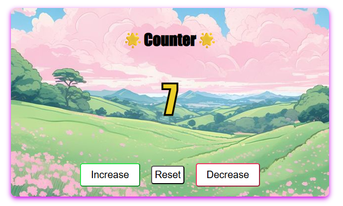

# 🌈 JavaScript Counter App

A small interactive counter application built with **HTML, CSS and JavaScript**.

This project was created as one of my **first JavaScript practice projects** after about two weeks of learning web development.  
The goal was to better understand how JavaScript interacts with HTML elements and how user actions (like button clicks) can update the UI.

---

---

# 📖 About The Project

This project is a simple **counter application** where the user can increase, decrease, or reset a number.

The purpose of this project was to practice the **fundamentals of JavaScript** and understand how JavaScript can manipulate elements on a webpage.

To make the project more visually interesting, I also experimented with **CSS styling and animations**, including a rainbow animated counter number.

This project represents one of my **first steps into JavaScript development**.

---

# ✨ Features

- ➕ Increase counter
- ➖ Decrease counter
- 🔄 Reset counter
-  Counter cannot go below **0**
-  Counter stops at **20**
-  "MAX" text appears when the maximum value is reached
-  Animated rainbow counter text
-  Simple card style UI design
-  Interactive button behavior

---

# 🧠 What I Learned

While building this project I practiced and learned:

### JavaScript
- `document.querySelector()`
- `addEventListener()`
- working with **variables**
- updating elements using `textContent`
- writing **conditional logic with `if`**
- creating **min / max limits**
- controlling UI behavior with JavaScript

### DOM Manipulation
- selecting HTML elements
- changing content dynamically
- reacting to user input (button clicks)

### CSS
- creating a **card layout**
- styling buttons
- using **CSS animations**
- creating a **rainbow text effect**
- experimenting with UI design

### Problem Solving
During development I also experienced typical beginner issues such as:
- debugging small mistakes
- fixing file linking errors
- understanding how JavaScript connects to HTML

Solving these problems helped me better understand the development process.

---

# 📂 Project Structure
index.html
style.css
script.js
preview.png
README.md
